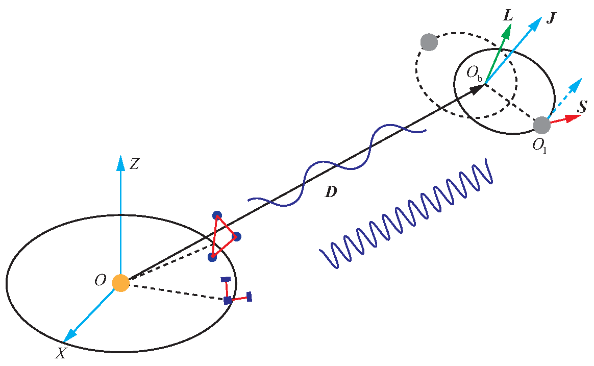

# Galactic-DNS-as-dual-line-GW-source

This repository is designed to simulate Galactic double neutron stars (DNSs) as dual-line gravitational wave (GW) sources. The simulations are based on [population synthesis of DNSs with LISA](https://github.com/TomWagg/detecting-DCOs-in-LISA). 

DNSs could serve as intriguing dual-line GW sources. They emit both high- and low-frequency GWs, arising respectively from the asymmetric spinning bodies of individual NSs and the binary orbital inspiral.

[Schematic of a dual-line GW source and its detection (Feng et al. 2024)](https://arxiv.org/abs/2401.11241v1)


## Citations
If you use any figures, code, or results from this paper, please cite [Feng and Shao (2025)](https://arxiv.org/abs/2505.05900) with the Bibtex entry listed below:
```
@article{Feng:2025jnx,
    author = "Feng, Wen-Fan and Shao, Lijing",
    title = "{Galactic double neutron stars as dual-line gravitational-wave sources: Prospects with LISA and Cosmic Explorer}",
    eprint = "2505.05900",
    archivePrefix = "arXiv",
    primaryClass = "gr-qc",
    doi = "10.1103/bqtw-vdws",
    month = "5",
    year = "2025"
}
```
